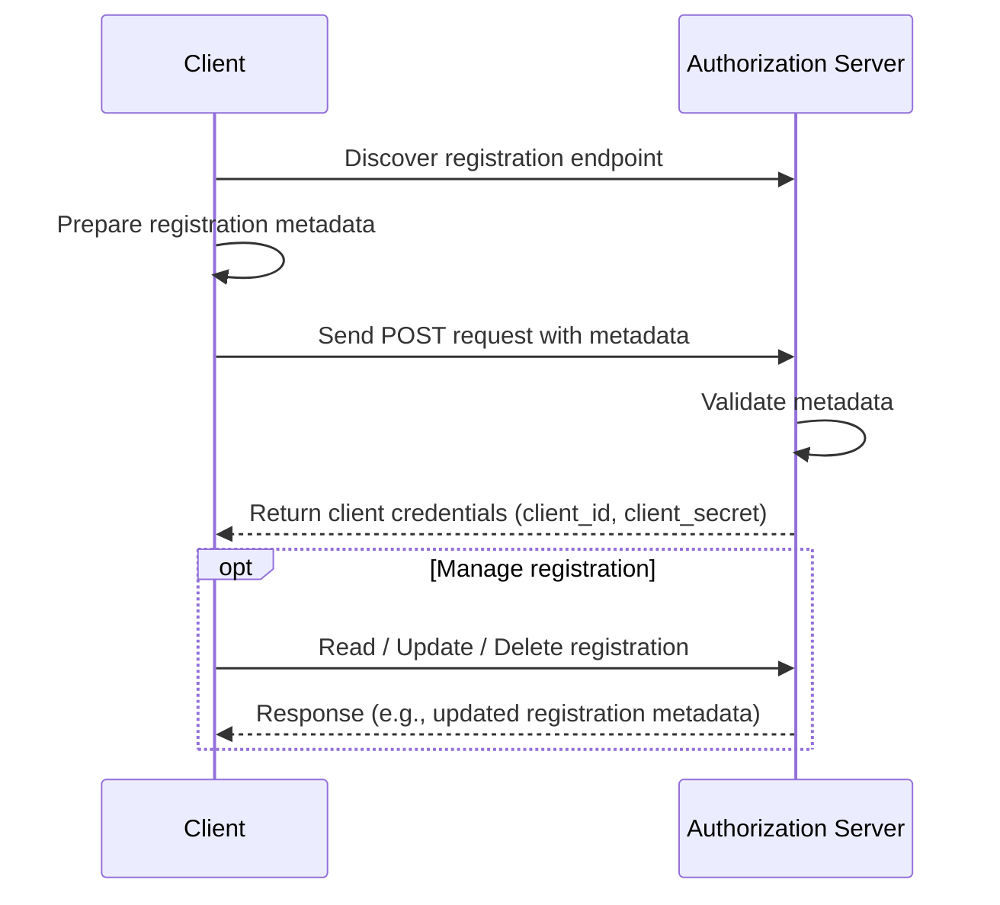
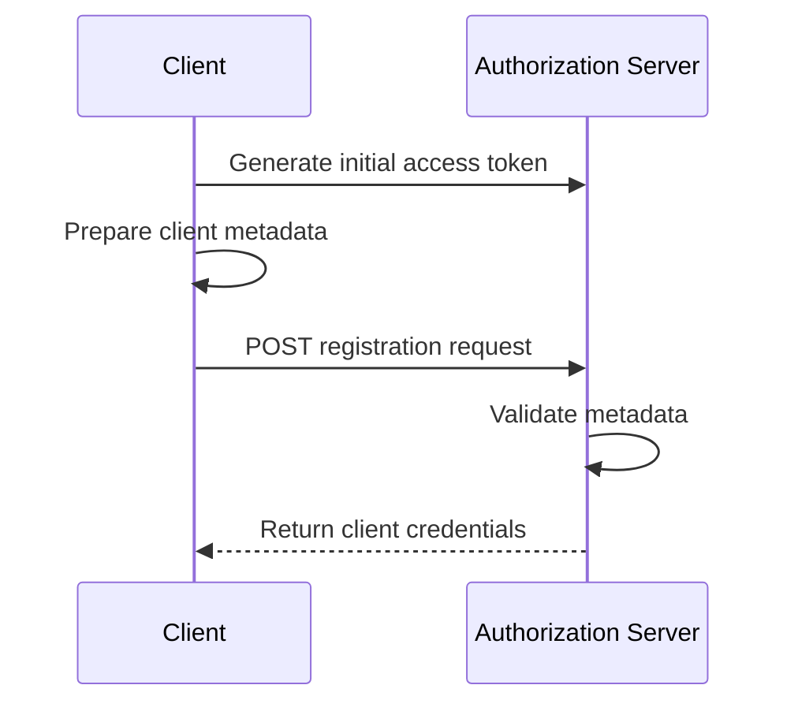
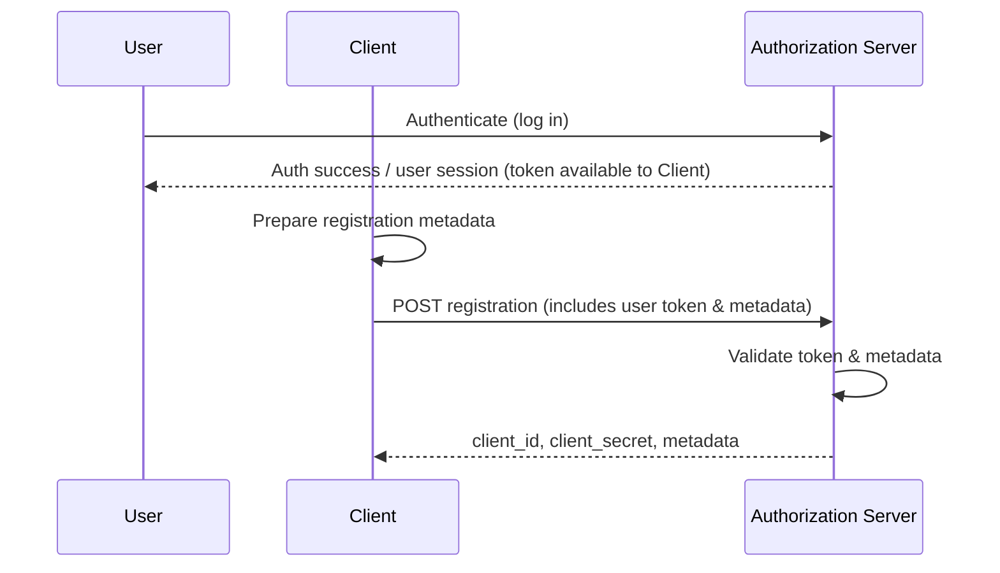

## Target Audience

Vert.x product owners, developers, and community.

## Version and Tracking

| Version | Author                                           | Reviewers                                 |
|---------|--------------------------------------------------|-------------------------------------------|
| Draft   | [Sanju Thomas](https://github.com/sanjuthomas)   | [Paulo Lopes](https://github.com/pmlopes) |

## Prerequisites 

This document assumes that the reader has a foundational understanding of web security principles and is familiar with the OAuth 2.0 ecosystem.

## Background

[RFC 7591](https://datatracker.ietf.org/doc/html/rfc7591) was written to standardize the process of client registration in OAuth 2.0 and OpenID Connect ecosystems to address the limitations of manual, inconsistent,
and non-scalable client registration methods that were common before its publication. [RFC 7591](https://datatracker.ietf.org/doc/html/rfc7591). The OAuth 2.0 Dynamic Client Registration Protocol, addresses these limitations by enabling clients to register with the authorization server programmatically at runtime.

By defining a standard HTTP-based protocol for dynamic client registration, [RFC 7591](https://datatracker.ietf.org/doc/html/rfc7591) enabled:

- Automation of the client on-boarding process
- Scalability for large or self-service ecosystems
- Interoperability between clients and diverse identity providers
- Security through well-defined metadata handling and controlled issuance of credentials

## Relevant RFCs

### OAuth 2.0 Dynamic Client Registration Protocol

[RFC 7591](https://datatracker.ietf.org/doc/html/rfc7591): Defines how clients register with the authorization server using HTTP POST.

### OAuth 2.0 Dynamic Client Registration Management Protocol

[RFC 7592](https://datatracker.ietf.org/doc/html/rfc7592): Adds capabilities to manage (read/update/delete) a client registration.

### OpenID Connect Dynamic Client Registration 1.0

Extends [RFC 7591](https://openid.net/specs/openid-connect-registration-1_0.html#ClientRegistration) for use in OpenID Connect.
### OAuth 2.1 (draft)

[OAuth 2.1](https://datatracker.ietf.org/doc/html/draft-ietf-oauth-v2-1-01) consolidates best practices but does not formally include Dynamic Client Registration (DCR). It’s still referenced as an optional capability via [RFC 7591](https://datatracker.ietf.org/doc/html/rfc7591).

## A case to invest

While there are many RFCs in the OAuth and identity landscape,  [RFC 7591](https://openid.net/specs/openid-connect-registration-1_0.html#ClientRegistration) stands out as a strategic enabler for next-generation, large-scale systems. The need to support automated, secure, and scalable client on-boarding has never been greater. Driven by trends in platform engineering and AI Agents.
### Large-Scale Platform Engineering and Self-Service On-boarding

Modern platform engineering teams are building self-service infrastructure for thousands of internal and external developers. Static client registration quickly becomes a bottleneck in these environments. Implementing [RFC 7591](https://datatracker.ietf.org/doc/html/rfc7591) allows:
- Automated provisioning of OAuth clients in CI/CD workflows
- Reduced operational burden on the platform and security teams
- Support for multi-tenant and zero-trust architectures where clients are ephemeral and per-tenant/client config is the norm

By enabling dynamic registration, Vert.x becomes a natural fit for enterprise platform teams embracing internal developer platforms (IDPs), Kubernetes-native tooling, and automated governance. 
### Evolving AI Agent and Machine to Machine Ecosystem
As we are all aware, the AI-native world is rapidly emerging, with autonomous agents, microservices, and machine-to-machine (M2M) workloads being deployed on a massive scale. These entities need:
- Secure and automated registration without human provisioning
- Dynamic client registration is crucial infrastructure for scaling identity in an AI-agent ecosystem for use-cases like LLMs to API interactions, event driven job orchestration, or federated learning nodes negotiating access securely.

[RFC 7591](https://openid.net/specs/openid-connect-registration-1_0.html#ClientRegistration) is a foundational capability that allows the identity layer to keep pace with the scale and fluidity of autonomous, compute-driven interactions.

## How does it work

### Open Registration Flow

Dynamic client registration without authentication is the most permissive configuration. It is generally used only in testing environments or exceptionally open ecosystems.

| Step | Action                                 | Initiator     |
|------|----------------------------------------|---------------|
| 1    | Discover registration endpoint         | Client        |
| 2    | Prepare metadata                       | Client        |
| 3    | Send POST request                      | Client        |
| 4    | Validate metadata                      | Auth Server   |
| 5    | Return client credentials              | Auth Server   |
| 6    | Manage registration (optional)         | Client        |

### Client Authenticated Registration Flow

Dynamic client registration for clients that possess an initial access token obtained via the client credentials flow or through trust established via X.509 certificate. In this scenario, the authorization server validates the client's identity.

| Step | Action                           | Initiator     |
|------|----------------------------------|---------------|
| 1    | Generate an initial access token | Client        |
| 2    | Prepare metadata                 | Client        |
| 3    | Send POST request                | Client        |
| 4    | Validate metadata                | Auth Server   |
| 5    | Return client credentials        | Auth Server   |
| 6    | Manage registration (optional)   | Client        |

### User Authenticated Registration

User Authenticated Registration enables scenarios where an end user is allowed to dynamically register clients on a platform, using their own identity as the basis for authorization.

| Step | Description                                                                                    | Initiator            |
|------|------------------------------------------------------------------------------------------------|----------------------|
| 1    | User Authentication - The user logs into the authorization server to establish their identity. | User                 |
| 2    | Prepare metadata                                                                               | Client               |
| 3    | Send POST request  - The client sends a registration request using the user's token.           | Client               |
| 4    | Validate token and metadata                                                                    | Authorization Server |
| 5    | Return client credentials                                                                      | Authorization Server |
| 6    | Manage registration (optional)                                                                 | Client               |

## Conclusion

Implementing OAuth Dynamic Client Registration ([RFC 7591](https://openid.net/specs/openid-connect-registration-1_0.html#ClientRegistration)) in Vert.x is a strategic investment that supports the growing demand for automation, self-service, scalability, and interoperability in modern identity ecosystems. 